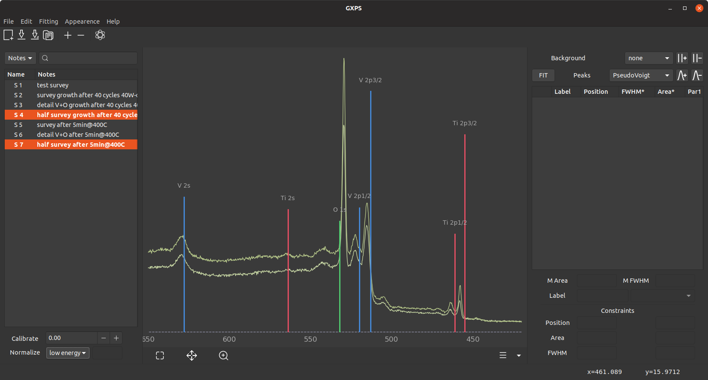
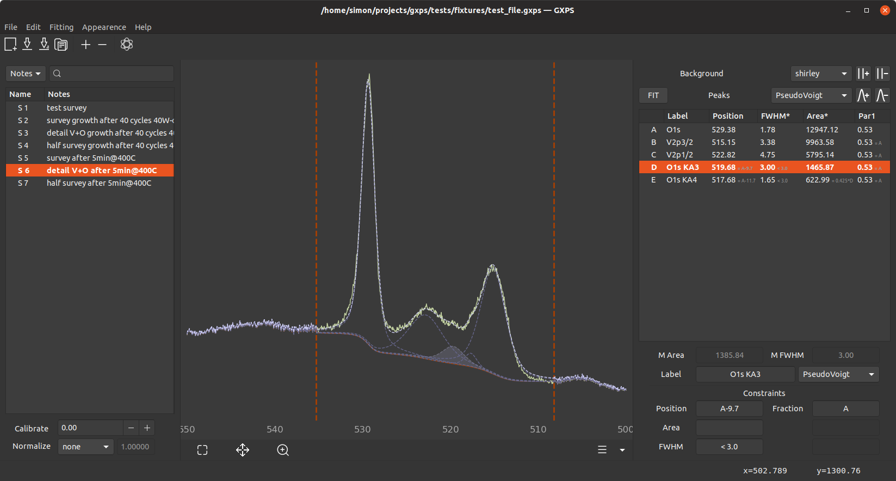

<p align="center">

</p>

# GXPS

*This project is still under development. Don't expect everything to work. If you encounter any bugs, please report them to me and include a logfile (On Linux: `~/.cache/gxps/logs`, on Windows: `C:\Users\$USER\AppData\Local\gxps\logs`).*

GXPS is a tool for visualizing and fitting X-ray photoelectron spectroscopy (XPS) data (although it may be possible to support also other kinds of spectroscopy data). For the fit, a variety of peak and background models are or will be implemented. Fit parameters can be constrained easily.

## Installation
### Ubuntu (or other Linux distros)

GTK needs to be version `>=3.14`. If you don't already have it installed, install python (`>=3.5`) and pip as well as libffi6 and python-gi through your package manager:

```shell
$ sudo apt install python3 pip3 libffi6 python3-gi libgirepository1.0-dev \
  python3-gi-cairo gir1.2-gtk-3.0
```

(I don't know if you really need all of those dependencies)

GXPS is available via pip (don't use sudo!):

```shell
$ python3 -m pip install gxps
```

Update like this:

```shell
$ python3 -m pip install --no-deps --force-reinstall --upgade gxps
```

The pip installation puts a `.desktop` file into the `$HOME/.local/share/applications` directory, so it should appear as a normal installed application. You can also call it via `$ gxps`.

### Windows

For running from source, please refer to [these instructions](build_win/README.md). The more convenient method, however, is just running the pre-built `.exe` that you can find [here](https://github.com/schachmett/gxps/releases/latest). Just download the appropriate `.zip` file and extract it. Inside is an executable that runs the program. GXPS creates a folder in `C:\Users\$USER\AppData\gxps` for log files and configuration files.

I plan on making a standalone `.exe` without the big folder around it and also on maybe making an installer later. Please note that GXPS seems to be significantly slower in Windows. Also, the builds are only tested in Windows 10 and I have no idea if it runs on older versions. Also, GXPS is quite ugly on Windows. I will at least try and make icons that work in a non-dark mode.

### OS X

It seems to be possible to run GXPS on a Mac but I don't know how.

## Usage

### Importing and visualizing spectra

For now, only files from the Omicron EIS software can be parsed. If you have another file format, please provide me with an example and I can write a parser for that. Or write one yourself in the [gxps.io module](gxps/io.py). Spectra can be imported via the Edit menu or the "Plus" button, they can be removed again by making them active and clicking the "Minus button".

On the left, the parsed spectra are listed. Through a right click, you can edit metadata and show the selected spectra in the spot (make them "active"). Below the table, you can shift the active spectra to calibrate the energy axis and you can normalize them. The "Atom" symbol in the top bar allows you to select elements whose spectral lines are shown as vertical lines in the plot:



### Fitting

The panel on the right manages the spectrum fitting. Through the "Parallel Lines Plus" symbol, regions are defined in which the chosen background subtraction algorithm is applied. You have to click and drag to draw the region. The "Parallel Lines Minus" symbol is for deleting these regions (click the region). Below that, new Peaks can be added via clicking and dragging in the plot. The Chooser Box defines the model of the added peak. The FIT button on the left does the actual fit.



Below the list of peaks are some buttons to manipulate the "active" peak. The label and the peak model can be changed and Parameters can be pinned to values or other parameters. Position, Area and FWHM are valid for each peak model. The values on the right vary however. Syntax is: 

* Type a value and hit enter. This fixes the parameter to that value.
* Type boundaries like `< 530` or `>515 <517.3`.
* Type a simple formula like `A*5` or `B + 1.5` where `A` and `B` refer to another peak's same kind of parameter (if you are editing D's area, `A` refers to A's area). The unique letter of each peak is shown on the left in the peak table.

### Exporting data

Through "File" → "Export as txt..." and "Export as image..." you can export your data to useful file formats. Image exporting will include some features for making nice plots. For now, however, the dialog does nothing besides saving an image in the default design (all the buttons are not working here).

Saving and opening a project is also possible in the "File" menu.


## Peak models

This section will explain the peak models that are used.


## Building

### PyPI

Uploading a new version of GXPS to the PyPI works as follows:

```shell
python3 setup.py sdist bdist_wheel
python3 -m twine upload dist/*
```

### Windows

Please refer to [this manual](build_win/README.md).